# Real-Time School Bus Detection Using Image Processing and a Custom CNN

**Course:** CS 898BA -- Image Analysis and Computer Vision
**Student:** Ijeoma Nwosu

---

## Table of Contents

1. Project Overview
2. Abstract
3. Project Motivation
4. Problem Statement
5. Project Objectives
6. Key Features
7. Repository Structure
8. Software and Technologies

---

## Project Overview

School buses are among the most recognizable vehicles on public roads and play a
vital role in student transportation. As smart surveillance systems continue to
evolve, there is an increasing demand for automated techniques capable of
identifying vehicles accurately and efficiently. Automated school bus detection
can support applications such as traffic monitoring, school-zone safety,
transportation analytics, and intelligent surveillance.

This project presents a complete computer vision solution for detecting school
buses from still images using a combination of classical image processing
techniques and a custom-built Convolutional Neural Network (CNN). Unlike many
modern object detection systems that rely on pretrained deep learning models
such as YOLO, Faster R-CNN, or SSD, this project was intentionally developed
from scratch to satisfy the course requirement of implementing an original deep
learning solution.

The proposed system first enhances image quality using Contrast Limited Adaptive
Histogram Equalization (CLAHE), followed by color-based segmentation in the HSV
color space to isolate the characteristic yellow color commonly associated with
school buses. Morphological operations are then applied to reduce noise and
improve the segmented regions before the processed image is passed to a
lightweight CNN classifier. The classifier predicts whether the image contains a
school bus or a background scene.

---

## Abstract

The objective of this project is to design and evaluate a custom computer vision
pipeline capable of distinguishing school buses from background scenes using
image processing and deep learning. A compact Convolutional Neural Network was
trained from scratch using a manually prepared dataset consisting of school bus
and background images. Prior to classification, each image underwent
preprocessing techniques including contrast enhancement with CLAHE, color
segmentation in the HSV color space, and morphological filtering.

Experimental evaluation showed that a decision threshold of 0.40 provided the
best overall performance, resulting in a classification accuracy of 70.27%.

---

## Project Motivation

Modern intelligent transportation systems benefit from automatic vehicle
recognition. School bus detection can improve school-zone safety, traffic
monitoring, and smart surveillance. This project investigates whether combining
traditional image processing with a lightweight CNN can provide effective
detection without pretrained networks.

---

## Problem Statement

The goal is to distinguish school buses from background scenes despite
variations in lighting, viewpoint, shadows, and occlusions while avoiding
pretrained deep learning models.

---

## Project Objectives

- Build a custom CNN from scratch.
- Develop a reproducible preprocessing pipeline.
- Improve image quality using CLAHE.
- Perform HSV color segmentation.
- Apply morphological filtering.
- Evaluate using accuracy, precision, recall, F1-score, and confusion matrix.
- Demonstrate a complete inference pipeline.

---

## Key Features

- Custom CNN architecture
- CLAHE image enhancement
- HSV color segmentation
- Morphological processing
- Batch prediction
- End-to-end pipeline demonstration
- Comprehensive performance evaluation

---

## Repository Structure

```text
IjeomaNwosu-CS898BA-Project/
+-- dataset/
+-- models/
+-- outputs/
+-- utils/
+-- split_dataset.py
+-- AI_log.md
+-- README.md
```

---

## Software and Technologies

| Software / Library | Purpose |
| ----------------- | ------- |
| Python 3.10 | Programming language |
| TensorFlow / Keras | Deep learning |
| OpenCV | Image processing |
| NumPy | Numerical computing |
| Matplotlib | Visualization |
| Pandas | Reporting |
| Scikit-learn | Evaluation metrics |
| Git & GitHub | Version control |

---

## Dataset and Image Processing Pipeline

### Dataset Overview

The dataset used in this project was developed for binary image classification
with two classes:

- School Bus
- Background

The goal of the dataset is to enable the custom CNN to learn discriminative
visual features that distinguish school buses from scenes that do not contain a
school bus.

The images include a variety of viewpoints, backgrounds, illumination
conditions, and scales to improve the robustness of the classifier.

### Dataset Collection

School bus images were collected from publicly available image sources, while
background images were selected to represent scenes that do not contain school
buses. Images include outdoor environments, roads, parking lots, buildings,
vegetation, and other vehicles.

To improve diversity, images contain:

- Different camera angles
- Various lighting conditions
- Partial occlusions
- Different distances from the camera
- Urban and suburban scenes

### Dataset Validation

Before training, every image was inspected using a validation script to ensure
the dataset contained only readable image files. Corrupted or unreadable images
were removed before training.

#### Final Valid Dataset

| Category | Images |
| -------- | ------ |
| School Bus | 84 |
| Background | 150 |
| Total | 234 |

### Dataset Splitting

The dataset was divided into training, validation, and testing subsets.

| Dataset | Bus | Background |
| ------- | --- | ---------- |
| Training | 57 | 105 |
| Validation | 13 | 22 |
| Testing | 14 | 23 |

The training set was used to learn the model parameters, the validation set was
used for hyperparameter tuning and early stopping, and the testing set was
reserved for final evaluation.

### Data Exploration

The dataset contains noticeable variability that increases the difficulty of the
classification task.

Examples of variation include:

- Bright sunlight
- Cloudy weather
- Shadows
- Different bus orientations
- Partial visibility
- Background objects with similar colors

These variations help reduce overfitting and improve model generalization.

### Image Preprocessing

Image preprocessing improves image quality and emphasizes visual characteristics
before classification.

The preprocessing pipeline consists of four primary stages:

1. Image resizing
2. CLAHE contrast enhancement
3. HSV color segmentation
4. Morphological filtering

### Image Resizing

All input images are resized to a fixed resolution before being passed into the
CNN.

Benefits include:

- Consistent input dimensions
- Faster training
- Reduced computational cost
- Stable batch processing

### CLAHE

CLAHE enhances local contrast while preventing excessive amplification of image
noise.

Advantages include:

- Improved visibility
- Better edge definition
- Enhanced low-contrast regions
- Improved feature extraction

Unlike traditional histogram equalization, CLAHE operates on small image regions
and limits contrast amplification.

### HSV Color Segmentation

After enhancement, each image is converted from the RGB color space to HSV.

HSV separates:

- Hue
- Saturation
- Value

This representation makes yellow school buses easier to isolate than in RGB.

The segmentation step creates a binary mask highlighting pixels whose color
falls within the predefined yellow range.

### Morphological Operations

The binary mask produced by HSV segmentation often contains small holes and
isolated noisy pixels. Morphological image processing improves the segmentation
using:

#### Opening

Removes isolated noise while preserving large foreground regions.

#### Closing

Fills small holes inside segmented objects and creates smoother object
boundaries.

These operations significantly improve the quality of the segmented bus regions
before classification.

### Complete Processing Pipeline

```text
Input Image
      |
      v
Resize Image
      |
      v
CLAHE Contrast Enhancement
      |
      v
Convert RGB -> HSV
      |
      v
Yellow Color Segmentation
      |
      v
Morphological Opening
      |
      v
Morphological Closing
      |
      v
Processed Image
      |
      v
Custom CNN
      |
      v
School Bus / Background
```

### Benefits of the Preprocessing Pipeline

The preprocessing workflow provides several advantages:

- Improves image quality
- Enhances contrast
- Reduces image noise
- Highlights school bus color features
- Produces cleaner inputs for CNN classification
- Improves consistency across different lighting conditions

### Pipeline Summary

The preprocessing stage combines classical computer vision techniques with deep
learning. By enhancing image quality, isolating the characteristic yellow color
of school buses, and removing segmentation noise, the pipeline provides cleaner
and more informative inputs to the custom CNN, contributing to improved
classification performance.

---

## Custom CNN Architecture, Training Strategy, and Model Optimization

### Why a Custom CNN?

A primary requirement of this project was to develop a deep learning model
without using pretrained networks. Instead of transfer learning, a compact CNN
was designed and trained entirely from scratch using the prepared dataset.

This approach demonstrates the ability to build a complete image classification
model using fundamental deep learning concepts while maintaining a lightweight
architecture suitable for educational and modest hardware environments.

### Network Architecture

The final CNN consists of the following layers:

```text
Input Image
      |
      v
Conv2D (16 Filters, ReLU)
      |
      v
MaxPooling2D
      |
      v
Conv2D (32 Filters, ReLU)
      |
      v
MaxPooling2D
      |
      v
Conv2D (64 Filters, ReLU)
      |
      v
GlobalAveragePooling2D
      |
      v
Dense (32, ReLU)
      |
      v
Dropout
      |
      v
Dense (1, Sigmoid)
      |
      v
School Bus / Background
```

The model contains approximately 26,145 trainable parameters, making it compact
while still capable of learning meaningful visual features.

### Layer-by-Layer Explanation

#### Convolution Layers

Three convolutional layers extract increasingly complex image features:

- Conv2D (16 filters): learns low-level features such as edges and simple
  textures.
- Conv2D (32 filters): captures intermediate structures, including bus
  contours and color patterns.
- Conv2D (64 filters): learns higher-level representations useful for
  distinguishing school buses from background scenes.

All convolutional layers use the ReLU activation function to introduce
non-linearity.

#### Max Pooling

MaxPooling layers reduce the spatial dimensions of the feature maps, lowering
computational cost while retaining the most significant features.

#### Global Average Pooling

Instead of flattening a large feature map, GlobalAveragePooling2D summarizes
each feature map into a single value. This greatly reduces the number of
trainable parameters and helps reduce overfitting.

#### Dense Layer

A fully connected layer with 32 neurons combines the extracted features before
classification.

#### Dropout

Dropout randomly disables a portion of neurons during training to reduce
overfitting and improve generalization.

#### Output Layer

A single neuron with a Sigmoid activation function produces the probability that
an image belongs to the School Bus class.

### Training Strategy

The model was trained using supervised learning with labeled bus and background
images.

The workflow consisted of:

1. Load the training dataset.
2. Apply preprocessing and normalization.
3. Train the CNN using mini-batches.
4. Monitor validation performance.
5. Apply early stopping to prevent overfitting.
6. Save the best-performing model.

### Hyperparameter Configuration

| Parameter | Value |
| --------- | ----- |
| Optimizer | Adam |
| Learning Rate | 0.0005 |
| Loss Function | Binary Crossentropy |
| Batch Size | 32 |
| Output Activation | Sigmoid |
| Early Stopping | Enabled |

The Adam optimizer was selected because of its adaptive learning capability and
reliable convergence for image classification tasks.

### Model Optimization

Several experiments were performed to improve classification performance while
maintaining a lightweight model.

Optimization techniques included:

- Data augmentation
- Early stopping
- Learning rate tuning
- Compact architecture design
- Decision threshold tuning

These strategies improved generalization and reduced overfitting.

### Decision Threshold Optimization

Although the Sigmoid layer outputs probabilities between 0 and 1, the default
threshold of 0.50 did not provide the best balance between precision and recall.

Multiple thresholds were evaluated.

| Threshold | Accuracy | Observation |
| --------- | -------- | ----------- |
| 0.50 | 62.16% | Missed many buses |
| 0.45 | 62.16% | Little improvement |
| 0.40 | 70.27% | Best overall balance |
| 0.35 | 37.84% | Too many false positives |

The final model uses:

```python
DECISION_THRESHOLD = 0.40
```

This threshold increased the detection of school buses while maintaining
acceptable overall accuracy.

### Batch Prediction Workflow

To evaluate the trained model consistently, a batch prediction script processes
every image in the test dataset.

The workflow is:

```text
Load Test Images
        |
        v
Apply Same Preprocessing
        |
        v
Generate CNN Predictions
        |
        v
Apply Decision Threshold
        |
        v
Save CSV Results
        |
        v
Compute Metrics
        |
        v
Generate Confusion Matrix
        |
        v
Save Misclassified Images
```

Generated outputs include:

- Prediction CSV
- JSON metrics
- Confusion matrix image
- Folder of misclassified images

### Model Saving

The best-performing model was saved in the project's `saved_models` directory
for later evaluation and inference.

Saving the trained model allows consistent testing without retraining and
supports deployment of the final pipeline.

### Model Summary

The custom CNN demonstrates that effective school bus classification can be
achieved without pretrained networks. Careful architecture design,
preprocessing, early stopping, and threshold optimization contributed to a
lightweight yet effective classifier suitable for this project.

---

## Experimental Results, Performance Evaluation, and Discussion

### Experimental Results

After training the custom CNN, the final model was evaluated using the
independent test dataset. All test images were unseen during training and
validation, providing an unbiased estimate of model performance.

The evaluation measured the classifier's ability to distinguish between school
bus and background images using standard binary classification metrics.

### Test Dataset

| Class | Images |
| ----- | ------ |
| School Bus | 14 |
| Background | 23 |
| Total | 37 |

### Final Classification Accuracy

The best-performing model was obtained after applying a decision threshold of
0.40.

| Metric | Value |
| ------ | ----- |
| Accuracy | 70.27% |

Although the dataset is relatively small, the model demonstrated the ability to
correctly identify most background scenes while detecting a meaningful portion
of school bus images.

### Confusion Matrix

The final confusion matrix is shown below.

```text
                 Predicted
               Background   Bus
Actual
Background         21         2
Bus                 9         5
```

### Interpretation

- True Positives (TP): 5 bus images correctly identified.
- True Negatives (TN): 21 background images correctly classified.
- False Positives (FP): 2 background images incorrectly classified as buses.
- False Negatives (FN): 9 bus images missed by the classifier.

The relatively low number of false positives indicates that the classifier was
conservative when predicting the School Bus class.

### Performance Metrics

| Metric | School Bus |
| ------ | ---------- |
| Precision | 71.43% |
| Recall | 35.71% |
| F1-score | 47.62% |

#### Precision

A precision of 71.43% indicates that when the model predicts a school bus, the
prediction is usually correct.

#### Recall

The recall of 35.71% shows that the model still missed several school bus
images. Improving recall is an important area for future work.

#### F1-score

The F1-score balances precision and recall and summarizes the classifier's
effectiveness on the bus class.

### Threshold Analysis

Several probability thresholds were evaluated to determine the best trade-off
between precision and recall.

| Threshold | Accuracy | Observation |
| --------- | -------- | ----------- |
| 0.50 | 62.16% | Conservative predictions; many buses missed |
| 0.45 | 62.16% | Minimal improvement |
| 0.40 | 70.27% | Best overall balance |
| 0.35 | 37.84% | Excessive false positives |

Reducing the threshold from 0.50 to 0.40 significantly improved bus detection
while maintaining acceptable overall performance.

### Error Analysis

Inspection of the misclassified images revealed several common causes of errors.

#### Missed School Buses

Most false negatives occurred when:

- The bus occupied only a small portion of the image.
- Lighting conditions reduced the visibility of the yellow body.
- Trees, shadows, or other vehicles partially occluded the bus.
- The viewing angle differed substantially from the training examples.

#### False Positives

The few false positives generally involved background scenes containing:

- Yellow vehicles
- Construction equipment
- Yellow road signs
- Bright yellow objects with shapes similar to buses

### Discussion

The results demonstrate that a lightweight CNN trained entirely from scratch can
learn useful visual representations for school bus classification, even with a
relatively small dataset.

Several design decisions contributed to the final performance:

- CLAHE improved local contrast and enhanced visual details.
- HSV segmentation emphasized the characteristic yellow color of school buses.
- Morphological operations reduced segmentation noise.
- Early stopping reduced overfitting.
- Threshold optimization improved the balance between precision and recall.

While the model does not achieve the performance of large pretrained object
detection systems, it satisfies the project objective of building a complete
custom solution without transfer learning.

### Strengths

The proposed approach offers several advantages:

- Lightweight CNN architecture
- No pretrained models required
- Fast inference
- Modular implementation
- Reproducible preprocessing pipeline
- Suitable for educational and research applications

### Limitations

Despite encouraging results, several limitations remain.

- Limited dataset size
- Binary classification only
- No object localization or bounding boxes
- Sensitivity to lighting and occlusion
- Reduced recall for challenging viewpoints

These limitations provide opportunities for future improvements.

### Lessons Learned

This project reinforced several important computer vision concepts:

- The value of image preprocessing before deep learning.
- The importance of dataset quality and validation.
- The impact of decision thresholds on classifier performance.
- The trade-offs between precision and recall.
- The effectiveness of compact CNN architectures for specialized tasks.

### Final Summary

The final evaluation demonstrates that the proposed computer vision pipeline
successfully integrates classical image processing with a custom CNN to perform
school bus classification. Although additional data and architectural
improvements would likely improve performance, the project achieved its primary
objective of developing and evaluating a complete detection system from scratch.

---

## Project Execution, Future Work, and Conclusion

### Installation

#### Prerequisites

- Python 3.10 or later
- Git
- Visual Studio Code
- pip

#### Install Dependencies

```bash
pip install -r requirements.txt
```

### Running the Project

#### Train

```bash
python models/train_model.py
```

#### Evaluate

```bash
python models/evaluate_model.py
```

This produces accuracy, precision, recall, F1-score, and the confusion matrix.

#### Predict a Single Image

```bash
python models/predict_image.py "dataset/test/bus/schoolbus_39.jpeg"
```

#### Batch Prediction

```bash
python models/batch_predict.py
```

This generates:

- batch_prediction_results.csv
- batch_prediction_metrics.json
- batch_prediction_confusion_matrix.png
- misclassified_images/

#### Demonstrate the Complete Pipeline

```bash
python models/final_pipeline.py "dataset/test/bus/schoolbus_39.jpeg"
```

The script saves the original image, preprocessing stages, segmentation masks,
final prediction, summary visualization, and a JSON report.

### Future Work

Potential improvements include:

- Increase dataset size.
- Improve class balance.
- Add multi-class vehicle classification.
- Implement custom object localization.
- Support real-time video processing.
- Optimize the model for embedded devices.

### References

- TensorFlow Documentation
- OpenCV Documentation
- NumPy Documentation
- Scikit-learn Documentation
- Goodfellow, Bengio, and Courville. Deep Learning. MIT Press.
- Gonzalez and Woods. Digital Image Processing.

### Conclusion

This project successfully combined classical image processing techniques with a
custom CNN to classify school buses without using pretrained models.

The complete pipeline integrated CLAHE enhancement, HSV color segmentation,
morphological filtering, and CNN classification into an end-to-end workflow.
Using a decision threshold of 0.40, the final model achieved 70.27% test
accuracy on unseen images.

The project satisfied the course objectives while providing practical experience
in computer vision, deep learning, dataset preparation, model evaluation, and
software engineering.
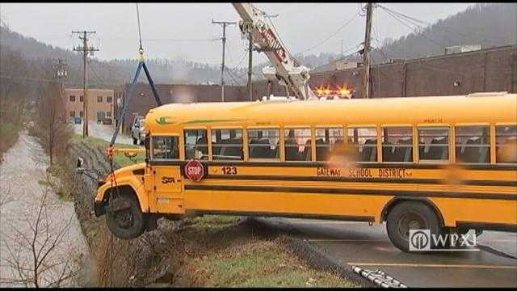

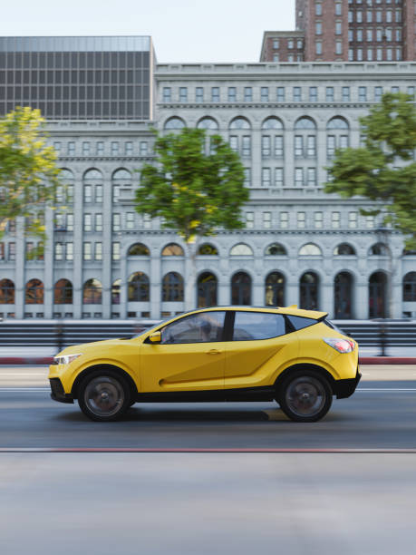

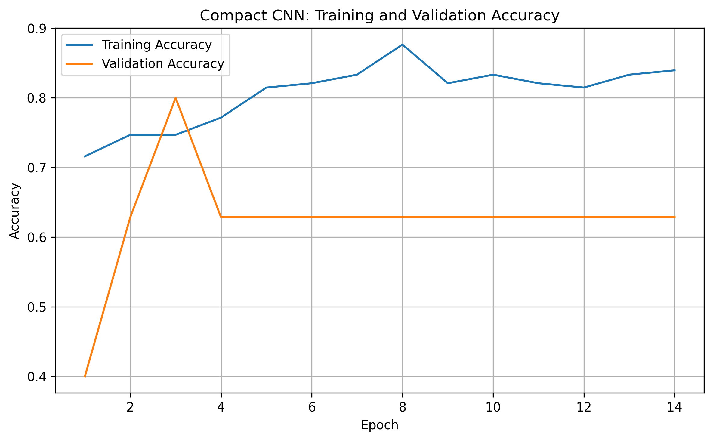

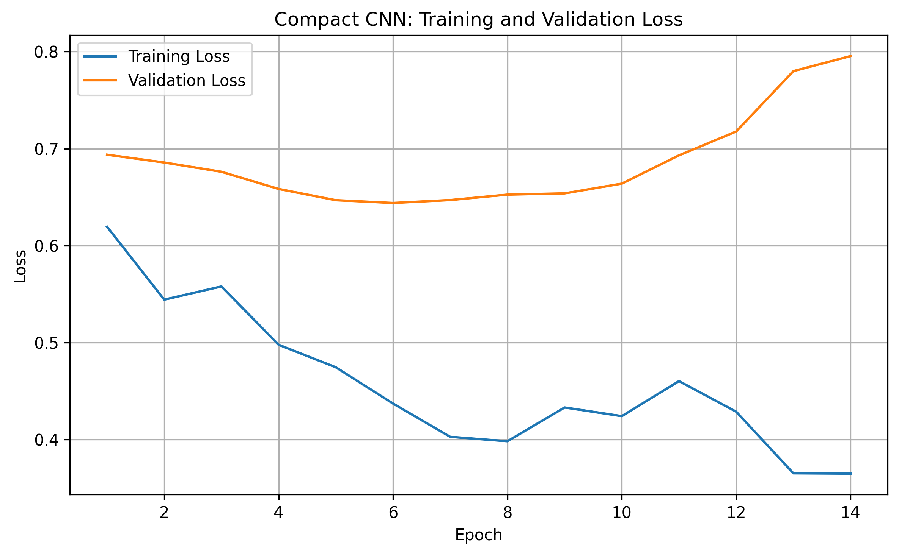

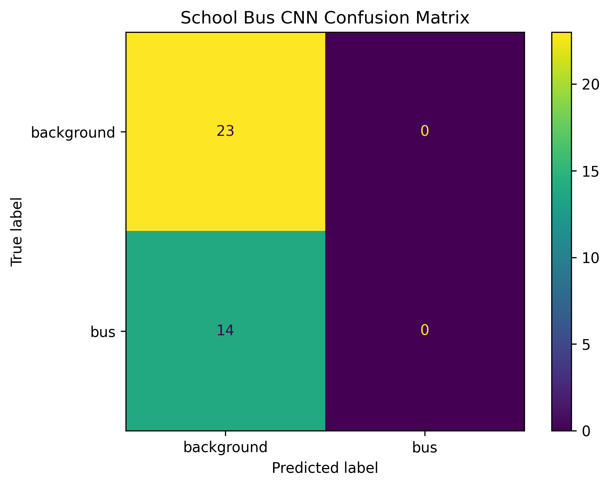

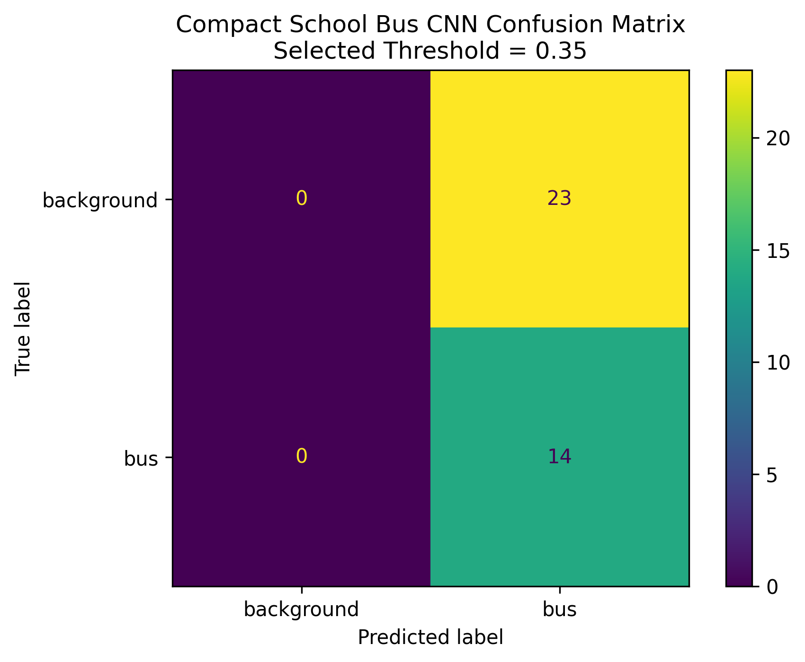

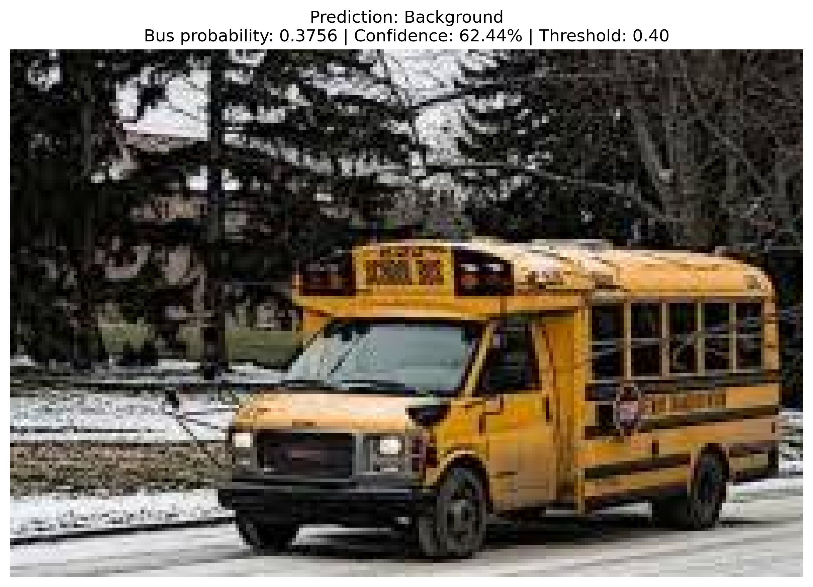

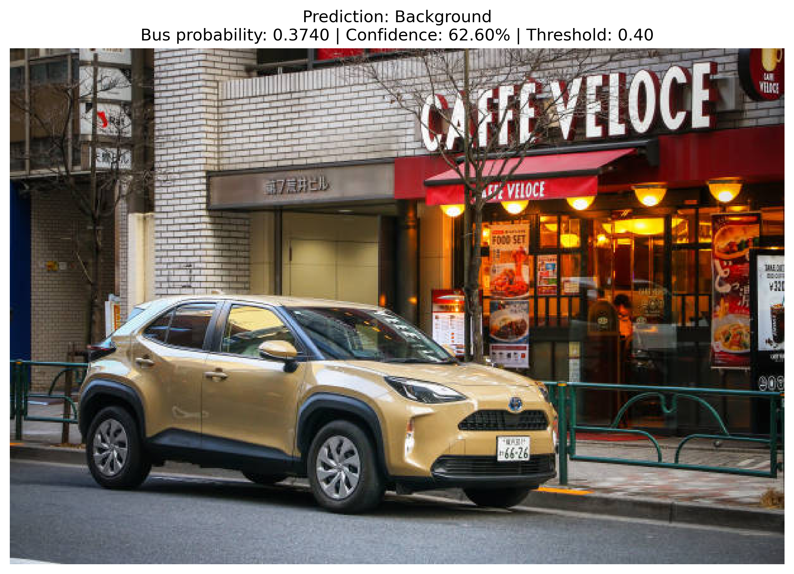


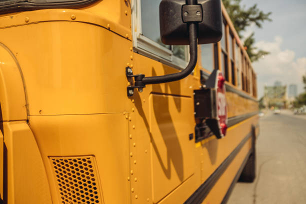

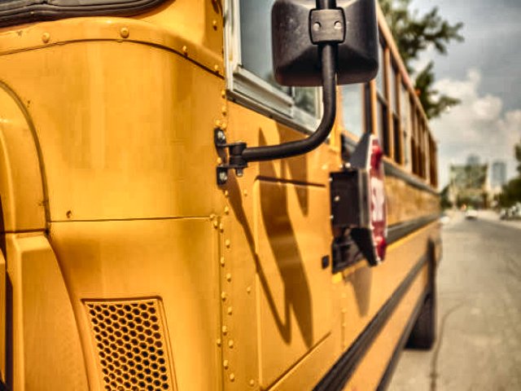

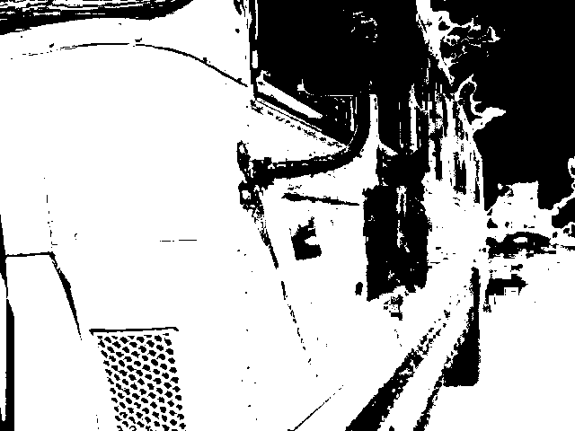

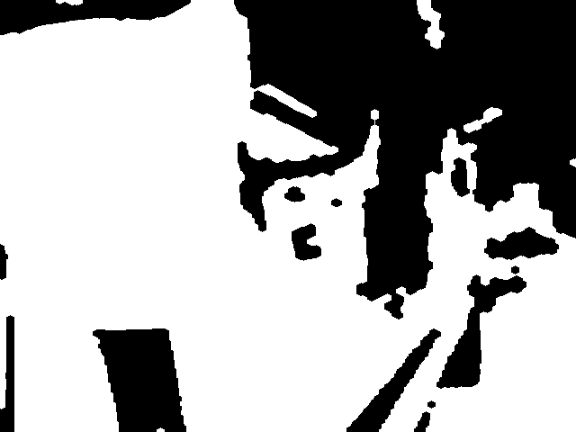

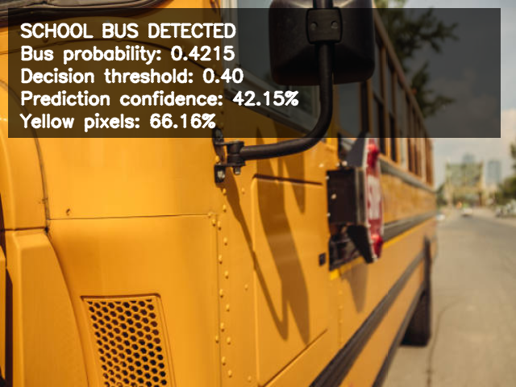
